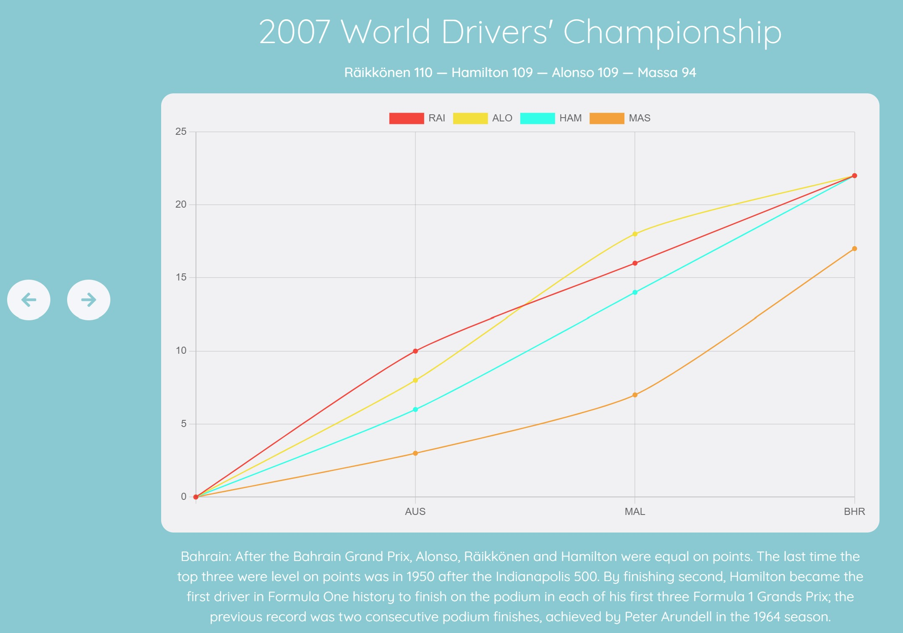
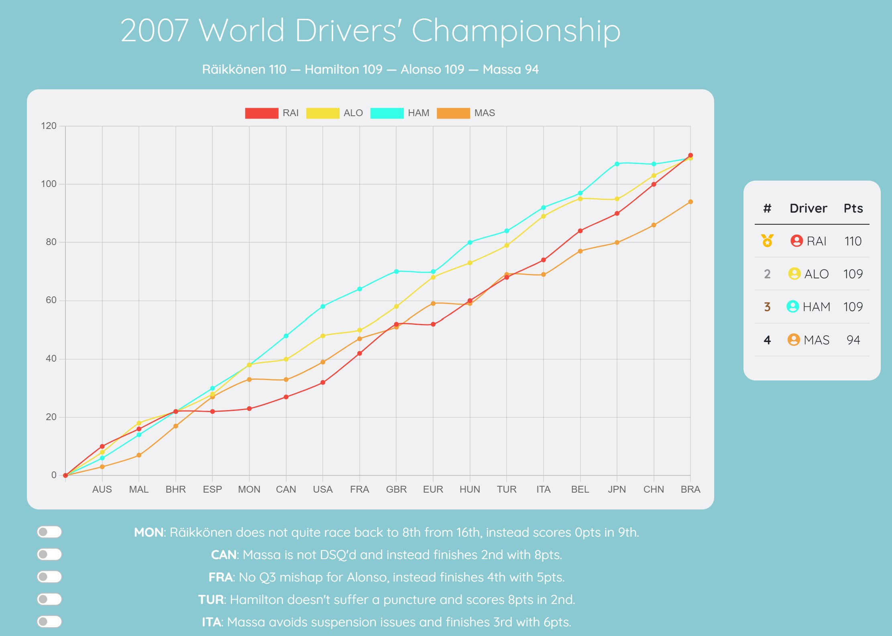

# InfluenceF1

#### **A simple Flask application to observe and manipulate results of key Formula 1 seasons.**

&nbsp;

Deployed here:  

&nbsp;

### **Features:**
 * The site displays results and standings data from the Ergast API for seasons which had extremely close standings, especially those where a dramatic or controversial event determined the result of the chamionship
 #### The site has two main 'modes'
 - A '**Replay Mode**' where users can navigate through a given season race by race to see where the crucial points were scored. Certain races also have information on dramatic or controversial moments that occured in a race.
 
 - Those dramatic moments are then taken over to the '**Simulator**' mode where users are able to toggle the events 'on and off' to see how those moments changed the result of the season. The toggle arrangement for each season can be saved to the user account and will automatically load in the next time that user visits the simulator
 

&nbsp;

### **API and Race Data:** 
* https://ergast.com/mrd/
* The data for the seasons, races, drivers is all found in the ergast API. No active calls are made, the data is all gathered during app deployment. 
* Information for 'changes' (the toggles in the simulator) was supplied by me.

&nbsp;

### **Tech Used:**
Front end 
- JavaScript (& jQuery)
- Chart.JS
- Boostrap

Back end 
- Python (w/ Flask)
- PostgreSQL
- SLQAlchemy
- WTForms
